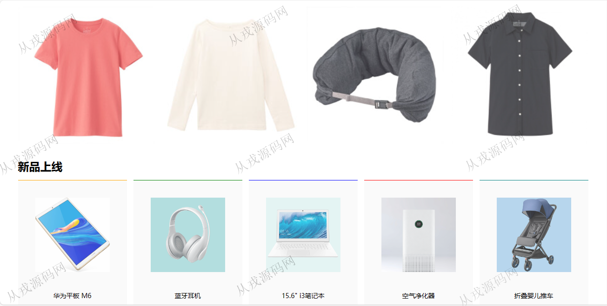
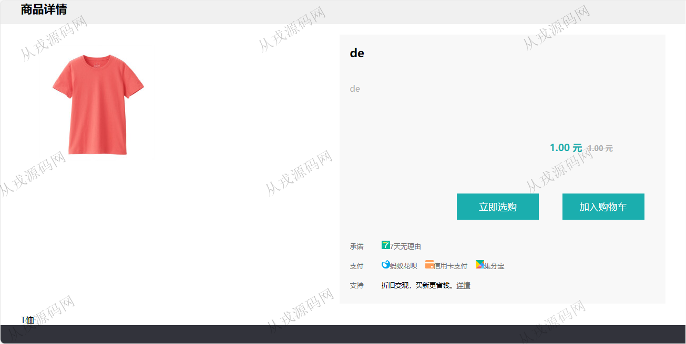
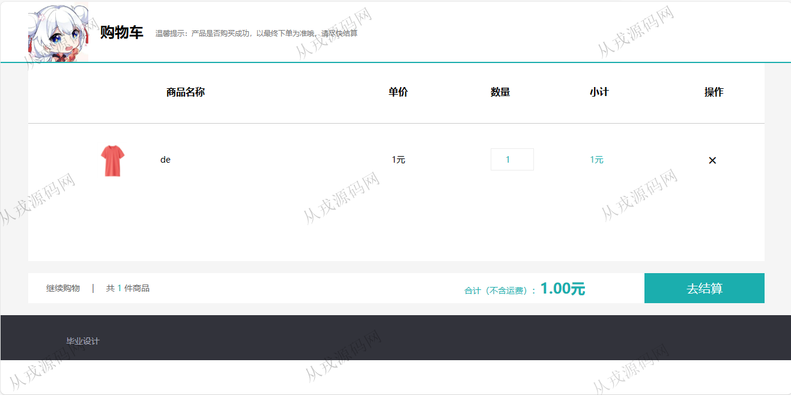
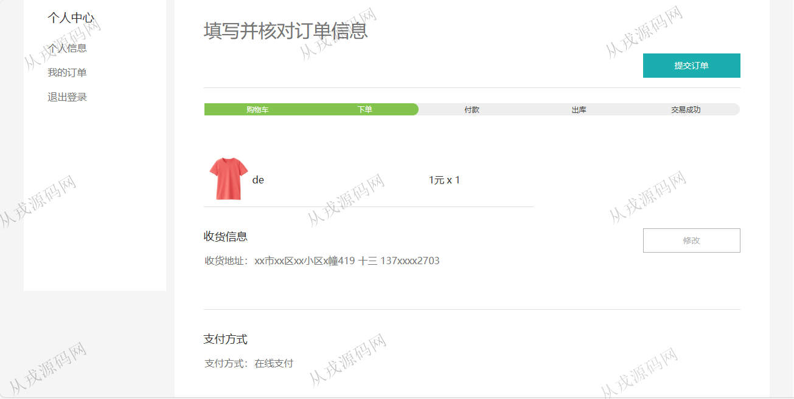
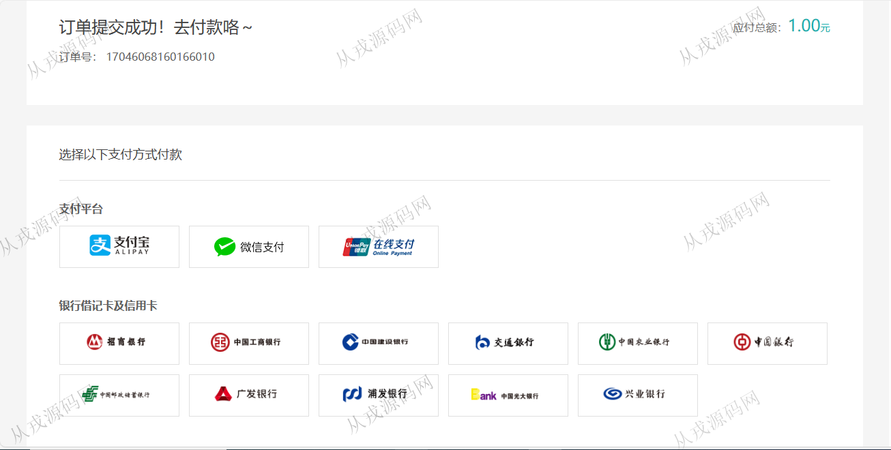
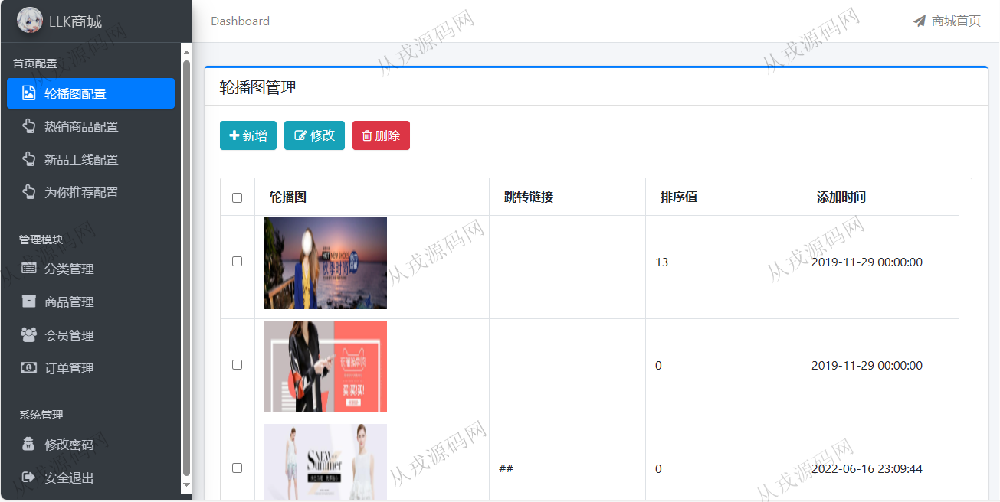
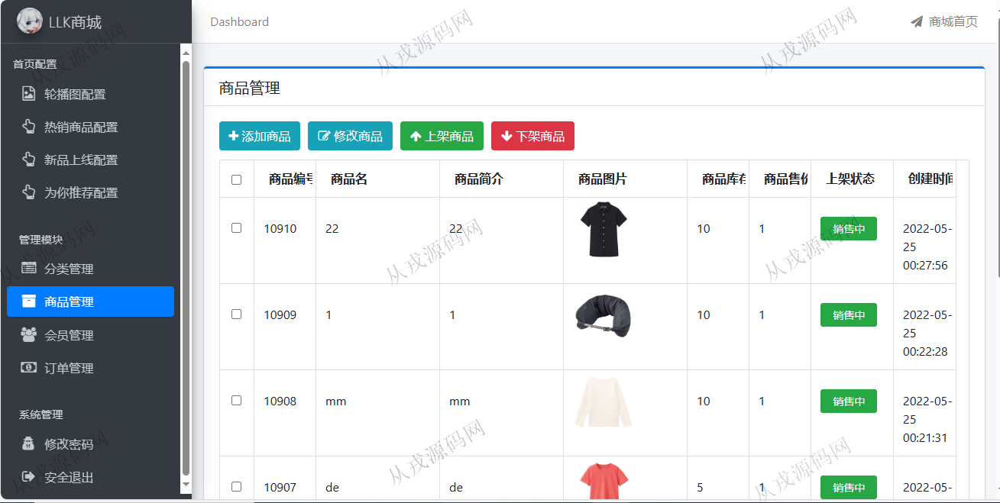
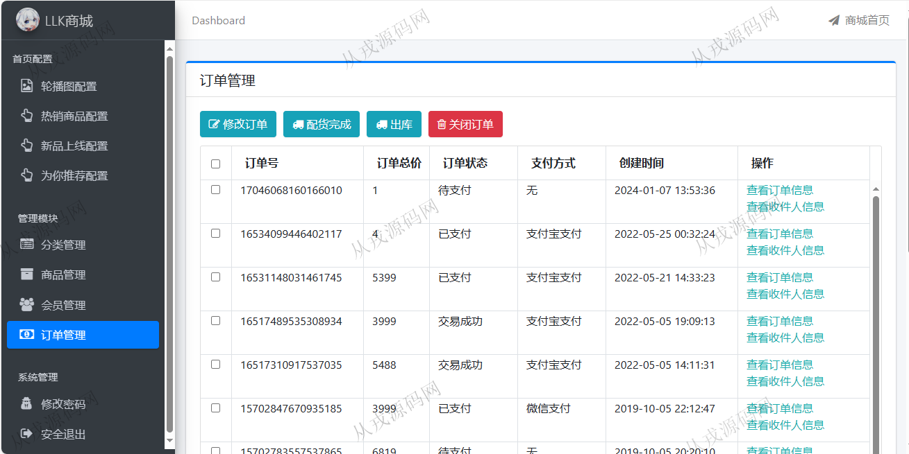

<h1 align="center">117.服装销售管理系统</h1>

 获取sql文件 QQ: 386869957 QQ群: 377586148 

 [推荐站点: 从戎源码网](https://armycodes.com/) 

## 简介

> 本代码来源于网络,仅供学习参考使用!
>
> 提供1.远程部署/2.修改代码/3.设计文档指导/4.框架代码讲解等服务
> 
> 访问地址: http://localhost:28089/
> 
> 会员：13700002703 123456
> 
> 后台管理：http://localhost:28089/admin/login
> 
> 管理员：admin 123456
> 

## 项目介绍
基于springboot的服装销售管理系统【含报告】：前端 html、jquery、bootstrap，后端 maven、springmvc、spring、mybatis，角色分为管理员、会员；集成商品展示、购物车，在线支付等功能于一体的系统。

## 功能介绍

### 会员

- 基本功能：登录、注册、退出
- 网站首页：分类导航，轮播图，新品上线、为你推荐，全局搜索
- 商品购买：商品详情，立即选购，加入购物车，购物车，购物车商品列表，购物车结算，提交订单，收货地址填写，在线支付
- 个人中心：个人资料查看与修改，我的订单列表查询，订单再支付

### 管理员

- 轮播图配置：轮播图信息的增删改查，配置完成网站首页轮播图实时更新
- 热销商品配置：热销商品增删改查，关联商品编号
- 新品上线配置：新品上线增删改查，关联商品编号
- 为你推荐配置：为你推荐增删改查，关联商品编号
- 分类管理：分类信息的增删改查，支持层级分类
- 商品管理：商品信息的增删改查，商品图片上传，商品上架和下架操作
- 会员管理：会员信息列表查询，会员禁用，会员解禁，会员信息由前台用户注册而来
- 订单管理：会员登录后在前台浏览商品提交订单后，管理员在管理后台查看会员下单的记录，完成配货，出库操作，关闭订单操作

## 环境

- <b>IntelliJ IDEA 2009.3</b>

- <b>Mysql 5.7.26</b>

- <b>JDK 1.8</b>

## 运行截图

